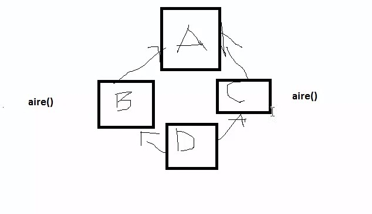

# Diamond problème

si une classe D hérite de deux classes B et C (pas possible en java) et que celle-ci possèdent la même méthode

--> quelle méthode appelera D celle de B ou celle de C

## implementation de 2 interfaces avec la même méthode

Une implémentation de 2 interfaces ayant chacune la même méthode ne posera pas de problème.
Puisque que c'est un contrat (une signature de méthode) que va implémenter la classe privé du contenu de la méthode.

--> permet de faire un pseudo héritage multiple sens les problèmes de choix de méthode