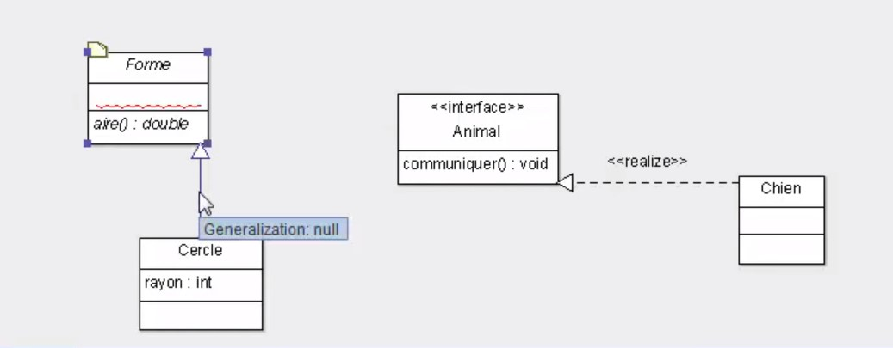

# Différence entre classes abstraites et Interfaces



## Classes abstraites

- peuvent avoir des méthodes abstraites comme des méthodes non abstraites (avec un corps)

- avoir un constructeur

- posséder des attributs

exemple :

````java
public abstract class Forme5 {
	
	protected int tq;

	public Forme5() {
	}
	
	public abstract double aire();
	
	public int toto() {
		return 1;
	}
}
````

Pourquoi déclarer une classe abstract 
--> la classe n'est pas un classe concrète, elle est généraliste , certaines méthodes n'ont pas de corps

## Interfaces

Les interfaces sont différentes des classes abstraites :

- ce ne sont pas des classes mais un nouveau type (interface)

- on ne peut avoir que des **méthodes publiques et abstraites** 
  (exception avec le mot clè default ou une methode static

- elles peuvent avoir des champs static ou final (mais pas d'attributs)

- toute classe qui va implémenter une interface sera obligée de redéfinir les méthodes de l'interface

 
 L'héritage est un couplage fort implique une dépendance fort entre parent/enfants
 
 Les interface ne lient les classes que par des contrats fonctions à redefinir
 
 Les interfaces permettent de simuler un héritage multiple
 
Example

Une interface Clickable que vont implémenter les classes Bouton et Image

Il n'y a pas de relation directe parent/enfant entre les classes et l'interface

Par contre Pour la classe abstraite Forme et les classent qui héritent de celle-ci (Carre, Cercle, Triangle); il y a une relation parent/enfant

## Choix

**classes abstraite si** :

- relation forte entre les classes 

- on veut avoir des membres private ou protected (attribut ou méthodes)

**interfaces si ** :

- si on a un semblant d'héritage multiple

- avoir une relation faible entre chaque objets
